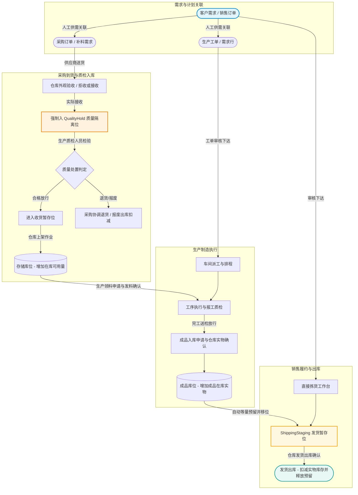

# 制造与仓储协同执行平台 (AI-Learn WMS & MES)

<p align="center">
  <a href="#-技术栈与环境基线"></a>
  <a href="#-技术栈与环境基线"></a>
  <a href="#-技术栈与环境基线"></a>
  <a href="#-技术栈与环境基线"></a>
  <a href="#-技术栈与环境基线"></a>
  <a href="#-技术栈与环境基线"></a>
  <a href="#-技术栈与环境基线"></a>
  <a href="#-技术栈与环境基线"></a>
  <a href="#-许可证"></a>
</p>

> **项目定位**：面向中小型离散装配制造企业的数字化协同执行平台一期项目，以“**销售需求 — 人工供需关联 — 采购入库 — 生产领料与执行 — 成品入库 — 销售发货**”为黄金业务闭环。系统严格以代码和配置为已实现事实，以领域规格（Spec）和高保真原型为目标指导。

---

## 目录导航

- [🎯 黄金业务闭环](#-黄金业务闭环the-golden-business-loop)
- [🏢 工作区定位与事实边界](#-工作区定位与事实边界)
- [✨ 核心功能模块全览](#-核心功能模块全览)
- [🏛️ 系统微服务架构与边界](#️-系统微服务架构与边界)
- [🛠️ 技术栈与环境基线](#️-技术栈与环境基线)
- [📂 源码结构与关键入口](#-源码结构与关键入口)
- [🚀 本地快速启动指南](#-本地快速启动指南)
- [👥 预置演示租户与账号](#-预置演示租户与账号)
- [📚 文档体系与推荐阅读顺序](#-文档体系与推荐阅读顺序)
- [⚖️ 开发原则与工程规范](#️-开发原则与工程规范)

---


## 🎯 黄金业务闭环（The Golden Business Loop）

系统围绕离散装配制造中最核心的端到端业务事实流进行建模，杜绝传统系统中的状态模糊与账实不符：



### 核心时点与制衡原则
1. **精确库存时点**：
   - **采购收货**：仅增加收货暂存/隔离库存；**上架**仅做库位移位，不重复增加入库量。
   - **销售预留**：`reserved_qty` 仅锁定可用量，不扣减在库实物库存（`on_hand_qty`）。
   - **直接拣货**：将物料从存储区移至发货暂存位（`ShippingStaging`），仍属于在库物料。
   - **发货确认**：只有仓库人员确认发货出库的瞬间，才真实扣减企业总实物库存并释放对应预留。
2. **权责分离与实物制衡**：
   - 到货外观验收由**仓库人员**执行，质量检验与放行/报废决定由**生产质检人员**做出，退货出库由**采购人员**协调，最终实物移位由仓库确认。
   - 生产领料与成品入库均由生产侧发起单据、仓库人员确认实物出入库，杜绝单方账实篡改。
3. **完备的人工完成机制（Manual Closure）**：
   - 销售与采购订单均支持业务终止时的人工完成，自动安全释放剩余预留，完整保留既有已执行的历史流水与收发货事实。

---

## 🏢 工作区定位与事实边界

### 1. 目录职责划分
- **当前开发根目录**：`ai_learn_developProject/` 是所有自研代码、配置、原型和规格维护的**唯一落地位置**。
- **只读参考工程**：`ai_learn_referenceProjects/`（如 jshERP, mall, OpenWMS, ThingsBoard 等）仅供学习、对比和思路借鉴，其代码和配置不代表本项目已实现事实。
- **历史记录**：根目录下的 `10周学习与开发总计划.md` 为前期学习计划档案，当前项目开发计划统一以 `ai_learn_developProject/docs/specs/00-project/正式项目计划.md` 为准。

### 2. 事实源优先级原则
在确认任何功能逻辑时，严格按以下优先级核对事实，凡未在仓库代码或正式 specs 中明确的事实严禁凭空捏造：
$$\text{实际生效代码与配置} \gg \text{构建依赖 (pom.xml/package.json)} \gg \text{docs/specs/ 领域规格} \gg \text{业务架构图} \gg \text{docs/prototype/ 交互原型}$$

---

## ✨ 核心功能模块全览

| 模块名称 | 所属服务 | 核心实现与业务能力 |
| :--- | :--- | :--- |
| **多租户与权限中心** | `platform-auth` | OAuth 2.0 / OIDC 语义认证；基于 Redis `jti` 的单账号唯一有效会话控制；Flyway V5 菜单多租户物理隔离；RBAC 角色-权限-菜单解耦绑定；全量 ID 前置校验；租户设置、用户、角色、权限与菜单后台管理。 |
| **主数据中心** | `platform-core` | 物料品类与商品主数据维护；多仓库定义、库区划分及库位（存储位、收货暂存位、发货暂存位、质量隔离位）主数据管理。 |
| **库存核心内核** | `platform-core` | 实物库存余额台账、订单占用预留明细；不可篡改的库存交易审计流水（入库、移位、扣减）；库位间直接调拨；周期性实物差异盘点与自动损益平账调整。 |
| **采购进货与质检** | `platform-core` | 采购订单全生命周期（草稿、提交、审核、人工完成）；到货外观验收与收货前拒收；到货强制隔离（QualityHold）；到货质量检验与放行/报废/退货处置判定；入库上架任务分配与确认。 |
| **销售履约与出库** | `platform-core` | 销售订单全生命周期；人工关联生产工单与采购来源；双轴状态生命周期模型；一键直接拣货（内部自动补足预留并移位发货暂存）；发货出库扣减实物库存；异常未拣预留释放与暂存退回。 |
| **MES 制造执行** | `platform-core` | 多级物料清单（BOM）与工艺路线定义；生产工单管理（关联来源销售行）；工序派工看板；工序开始/暂停/报工与工序过程质检；生产领退料流转；合格成品完工入库确认。 |
| **IoT 物联设备与告警** | `platform-iot` | 设备模型配置文件（Profile）与台账；MQTT 接入凭证与消息去重（`message_id`）；时序遥测实时监测；基于阈值的告警生成与自动/人工恢复；告警与生产工单/工序业务上下文关联。 |
| **空间地图与综合看板** | `platform-core` | 厂区二维平面站点地图（支持百分比坐标与点位画布配置）；全链路跨域全闭环追溯引擎（销售 ↔ 工单 ↔ 采购 ↔ 批次 ↔ 设备告警）；跨域异常中心；涵盖库存、履约、制造、质量等 7 类指标的综合监控大屏。 |
| **AI 智能业务助手** | `platform-core` | 基于自托管 Open WebUI 与 DeepSeek 大模型；严格通过 `wms-ai-api-whitelist.yml` 唯一白名单反向裁剪 OpenAPI，仅放行受控只读接口；基于网关恢复用户凭证并由下游 Spring Security 实时鉴权；提供流式问答与行为审计。 |

---

## 🏛️ 系统微服务架构与边界

系统后端采用清晰的模块化微服务架构，各服务物理独立部署，共用基础设施：

```text
                                 [ 前端客户端 (Vue 3 / TypeScript) ]
                                                │
                                                ▼ HTTP / SSE (端口: 20001)
                             ┌──────────────────────────────────────┐
                             │    platform-gateway (统一 API 网关)    │
                             │  - 统一路由转发与全局异常包装          │
                             │  - 粗粒度 JWT 基础校验与上下文透传     │
                             │  - AI OpenAPI 白名单裁剪目录生成     │
                             └──────┬────────────┬───────────┬──────┘
                                    │            │           │
           ┌────────────────────────┼────────────┴───────────┼────────────────────────┐
           ▼ 端口: 10002            ▼ 端口: 10003            ▼ 端口: 10004            │
┌──────────────────────┐ ┌──────────────────────┐ ┌──────────────────────┐            │
│    platform-auth     │ │    platform-core     │ │     platform-iot     │            │
│  - 登录认证与令牌签发 │ │  - 主数据 & 库存内核 │ │  - 设备模型与台账凭证│            │
│  - 租户上下文管理     │ │  - 采购 / 销售 / MES │ │  - 时序遥测与状态监测│            │
│  - 角色 / 权限 / 菜单 │ │  - 追溯 / 地图 / 看板│ │  - 设备告警与工序关联│            │
│  - 后台管理统一接口   │ │  - AI 对话与工具审计 │ │  - MQTT 接入与去重   │            │
└──────────┬───────────┘ └──────────┬───────────┘ └──────────┬───────────┘            │
           │                        │                        │                        │
           └────────────────────────┴────────────┬───────────┴────────────────────────┘
                                                 │
                          ┌──────────────────────┴──────────────────────┐
                          │     platform-shared (通用基础共享组件)        │
                          │   - 安全上下文封装 (SecurityContext)        │
                          │   - 统一响应结果封装 (Result<T>)             │
                          │   - 通用异常处理与公共工具库                 │
                          └─────────────────────────────────────────────┘
                                                 │
                     ┌───────────────────────────┼───────────────────────────┐
                     ▼                           ▼                           ▼
          [ PostgreSQL 12.1+ ]             [ Redis 7.0 ]             [ Mosquitto 2 ]
          - 统一库单 public schema       - 在线有效会话管理 (jti)   - MQTT 设备消息 Broker
          - 表前缀模块物理划分           - 权限高速缓存与防重放     - 遥测时序与状态推送
          - Flyway 独立版本表演进
```

### 核心架构与工程约束
- **单库多租户物理划分**：全系统共用 PostgreSQL `public` schema，以表前缀规范化业务域（`auth_`、`md_`、`inv_`、`iot_` 等），各模块独立管理 Flyway 历史表（如 `auth_flyway_schema_history`、`core_flyway_schema_history`）。
- **统一逻辑软删除**：核心实体与关联关系一律采用逻辑软删除（`isdel = 1` 为删除，有效为 `isdel = 0`），严禁执行物理 `DELETE`。
- **全量 ID 前置强校验**：用户分配角色、角色绑定权限与菜单时，必须一次性校验全量目标 ID 的存在性、租户归属及激活状态，遇非法 ID 整体回滚事务。
- **AI OpenAPI 唯一白名单机制**：AI 助手只读不写，严格通过 `wms-ai-api-whitelist.yml` 反向裁剪 OpenAPI，禁止通配放行，网关恢复可信用户 Header，下游方法级权限实时拦截。

---

## 🛠️ 技术栈与环境基线

### 后端技术栈
- **核心框架**：Java 21、Maven 3.9.1+、Spring Boot 3.3.5、Spring Cloud 2023.0.3 (Gateway)
- **数据持久层**：MyBatis-Plus 3.5.7、PostgreSQL JDBC 42.7.4、Flyway 10.10.0
- **安全认证**：Spring Security 6、JJWT 0.12.6、Nimbus JOSE+JWT
- **接口规范**：SpringDoc OpenAPI 3 (Swagger UI 2.6.0)
- **测试框架**：Testcontainers 1.20.1、JUnit 5

### 前端技术栈
- **核心环境**：Node 20.x、Vue 3.4.38、Vite 5.4.2、TypeScript 5.5.4
- **UI 组件库**：Element Plus 2.14.0、@element-plus/icons-vue
- **状态与路由**：Pinia 2.1.7、Vue Router 4.4.3
- **可视化与工具**：ECharts 6.1.0、VueUse 12.0.0、Axios 1.20.0、Day.js
- **测试框架**：Vitest 2.1.9、Playwright 1.63.0 (E2E 黄金事实测试)

### 中间件与服务端口矩阵
| 服务 / 组件 | 运行模式 / 镜像 | 监听端口 | 备注说明 |
| :--- | :--- | :--- | :--- |
| **API Gateway** | 本地 Spring Boot 进程 | `20001` | 统一网关入口与路由分发 |
| **Platform Auth** | 本地 Spring Boot 进程 | `10002` | 认证授权与租户服务 |
| **Platform Core** | 本地 Spring Boot 进程 | `10003` | ERP/WMS/MES 核心业务服务 |
| **Platform IoT** | 本地 Spring Boot 进程 | `10004` | 物联网设备管控与时序遥测 |
| **Frontend Web** | Vite Dev Server | `5173` | 前端用户界面 |
| **PostgreSQL** | `postgres:12.1` 容器 | `5433` (映射至宿主) | 数据库实例：`ai_learn` |
| **Redis** | `redis:7` 容器 | `6379` | 会话状态与权限缓存 |
| **Mosquitto** | `eclipse-mosquitto:2` 容器 | `1883` | MQTT 协议消息代理 |

---

## 📂 源码结构与关键入口

```text
ai_learn_developProject/
├── README.md                         # 项目总览、边界与阅读顺序
├── AGENTS.md                         # 当前生效的 AI 协作规则事实源
├── CLAUDE.md                         # 面向 Claude 的同步协作规则
├── .gitignore                        # Git 忽略规则
│
├── backend/                          # ☕ Spring Boot 后端工程
│   ├── pom.xml                       # Maven 聚合配置与公共依赖
│   ├── platform-gateway/             # 统一网关：GatewayApplication.java, application.yml
│   ├── platform-auth/                # 认证租户：AuthApplication.java, application.yml
│   ├── platform-core/                # 业务核心：CoreApplication.java, application.yml
│   ├── platform-iot/                 # 设备物联：IotApplication.java, application.yml
│   └── platform-shared/              # 共享模块：SecurityContext, Result<T>, 通用异常
│
├── frontend/                         # ⚡ Vue 3 + Vite + TypeScript 前端工程
│   ├── package.json                  # 前端依赖与脚本入口
│   ├── vite.config.ts                # Vite 构建配置
│   ├── index.html                    # 前端 HTML 入口模板
│   └── src/
│       ├── main.ts                   # 前端启动主入口
│       ├── App.vue                   # 应用根组件
│       ├── router/index.ts           # 前端路由与权限拦截守卫
│       ├── api/                      # 统一请求封装 (request.ts, auth.ts, admin.ts)
│       ├── stores/                   # Pinia 状态管理 (auth.ts)
│       └── views/                    # 各业务域视图组件
│
├── docs/                             # 📖 规格、原型、设计与验证记录
│   ├── 词汇定义表.md                  # 已确认的统一业务术语
│   ├── 架构思考卡.md                  # 架构边界与思考记录
│   ├── specs/                        # 正式领域规格事实源
│   │   ├── 00-project/               # 项目目标、计划、架构与规则总览
│   │   ├── 10-erp-wms/               # ERP/WMS 领域规格
│   │   ├── 20-mes/                   # MES 领域规格
│   │   ├── 30-iot-digital-twin/      # IoT 与数字孪生规格
│   │   ├── 40-gis-dashboard/         # GIS 与综合看板规格
│   │   └── 50-ai-assistant/          # AI 助手与审计规格
│   ├── 业务架构/                     # 交互式业务拓扑与事实流
│   │   ├── index.html                # 业务架构预览入口
│   │   └── 总览.html                 # 跨模块拓扑与黄金闭环图
│   ├── prototype/                    # 静态交互原型与演示页面 (50+ 页面)
│   │   ├── index.html                # 原型首页
│   │   └── pages/                    # 业务页面原型 (HTML)
│   ├── ai-knowledge/                 # 面向 Open WebUI 的受控业务知识视图
│   ├── verification/                 # 阶段验证总结与自动化测试证据
│   └── openspec/                     # 显式 OpenSpec 任务的工件体系
│
├── deploy/                           # 🐳 本地基础设施与部署编排
│   ├── docker-compose.yml            # PostgreSQL、Redis 与 Mosquitto 编排
│   ├── openwebui/                    # Open WebUI 部署与 API 校验
│   └── local/                        # 本机中间件配置
│
└── runtime/                          # ⚙️ 本机运行时依赖与手动启动说明
    └── README.md
```

---

## 🚀 本地快速启动指南

### 1. 启动基础设施中间件
进入部署目录，使用 Docker Compose 一键拉起 PostgreSQL、Redis 和 Mosquitto：

```bash
cd ai_learn_developProject/deploy
docker compose up -d
```

### 2. 构建与运行后端微服务
后端各模块通过 Flyway 自动执行数据库迁移，初次启动时会自动创建表结构并写入演示种子数据。

```bash
cd ai_learn_developProject/backend
mvn clean compile
```

建议按以下顺序在各模块目录下分别启动：
```bash
# 1. 启动 Auth 认证中心 (端口: 10002)
cd platform-auth && mvn spring-boot:run

# 2. 启动 Core 业务核心 (端口: 10003)
cd ../platform-core && mvn spring-boot:run

# 3. 启动 IoT 物联网服务 (端口: 10004)
cd ../platform-iot && mvn spring-boot:run

# 4. 启动 Gateway 网关服务 (端口: 20001)
cd ../platform-gateway && mvn spring-boot:run
```

### 3. 启动前端管理端
```bash
cd ai_learn_developProject/frontend
npm install
npm run dev
```
启动成功后，浏览器访问：`http://localhost:5173`。

---

## 👥 预置演示租户与账号

系统内置初始化演示租户：**华东制造一号基地**（`tenant_demo_a`），并提供 6 类业务角色的预置演示账号，默认初始密码统一为：`123456`。

| 角色类型 | 用户名 / 账号 | 默认密码 | 职责范围与权限覆盖 |
| :--- | :--- | :--- | :--- |
| **租户管理员** | `admin.zhang` | `123456` | 租户基础配置、用户维护、角色与权限分配、菜单管理及全模块只读审计 |
| **销售人员** | `sales.liu` | `123456` | 销售订单创建/提交/审核、履约进度跟踪、订单人工完成及全链路追溯 |
| **采购人员** | `buyer.chen` | `123456` | 采购订单创建/提交/审核、生产来源关联、供应商退回协调及人工完成 |
| **仓库人员** | `wh.operator` | `123456` | 到货外观验收/拒收、质量处置执行、库位上架、直接拣货、发货出库、领退料/入库实物确认 |
| **生产质检人员** | `mes.inspector` | `123456` | BOM 与工艺路线维护、工单审核派工、工序报工、到货与工序质检、放行/报废决定、生产单据发起 |
| **IoT 工程师** | `iot.engineer` | `123456` | 物联网设备模型与凭证管理、设备台账、时序遥测监测、告警人工确认与工序业务上下文关联 |

---

## 📚 文档体系与推荐阅读顺序

### 1. 核心文档直达索引
- **业务术语规范**：`docs/词汇定义表.md`（统一业务专业命名）
- **开发与交付计划**：`docs/specs/00-project/正式项目计划.md`（一期范围与里程碑）
- **业务规则索引**：`docs/specs/00-project/全模块业务规则总览.md`（七大业务域规则全集）
- **阶段决策记录**：`docs/specs/00-project/阶段决策与续聊入口.md`（已批准决策与对话锚点）
- **交互式业务架构图**：`docs/业务架构/index.html`（交互拓扑）与 `总览.html`（全域事实流）
- **静态交互原型**：`docs/prototype/index.html`（操作原型主入口）与 `docs/prototype/README.md`
- **AI 白名单规范**：`deploy/openwebui/wms-ai-api-whitelist.yml`（唯一受控只读接口白名单）
- **受控业务知识**：`docs/ai-knowledge/README.md`（Open WebUI 受控知识同步清单）

### 2. 建议的执行顺序（3 步走）
1. **统一语言**：通读 `docs/specs/00-project/正式项目计划.md` 与 `docs/词汇定义表.md`，明确边界与术语。
2. **核对闭环**：结合 `docs/specs/00-project/项目概述.md`、`架构设计.md` 与 `docs/业务架构/总览.html` 核对黄金业务闭环逻辑。
3. **先沟通再编码**：遇到库存扣减时点、状态迁移、权责分配或跨服务交互不明确时，务必先对齐规格文档再编写代码。

---

## ⚖️ 开发原则与工程规范

1. **黄金闭环优先于功能蔓延**：
   - 优先确保主流程跑通与数据一致性；一期明确不实现自动 MRP、APS 排程、三维数字孪生、全功能财务账套或具有写权限的自主 AI Agent。
2. **严格的 Spec 驱动开发（SDD）**：
   - 业务逻辑变更必须同步演进：业务语义 ➔ 领域规格（Spec） ➔ 交互原型 ➔ 数据模型 ➔ 接口契约 ➔ 代码实现。
3. **代码修改前 5 步检查法**：
   - **找入口**：定位对应的前端路由（`router/index.ts`）或后端 Controller 启动类。
   - **找调用链**：追踪 `View ➔ API Request ➔ Gateway ➔ Controller ➔ Service ➔ Mapper/Repository` 完整链路。
   - **找状态源**：确认数据来源于本地状态还是 Pinia 全局 Store，禁止滥用全局状态。
   - **找契约**：对照 `接口契约.md` 确认 REST Path、HTTP Method、DTO 结构及鉴权规则。
   - **找配置**：核对 `pom.xml`、`package.json`、`application.yml` 与环境基线。
4. **自动化测试前移与守护**：
   - 核心业务链路每周保持自动化回归测试（Vitest、Playwright、JUnit）。
   - 修改前端代码后运行 `npm run build` 或 `vue-tsc --noEmit` 进行类型与构建校验；修改后端后运行 `mvn test` 验证编译与依赖完整性。

---

## 📄 许可证

本项目采用 [Apache-2.0 License](LICENSE) 协议。仅供学习交流与二次开发！
